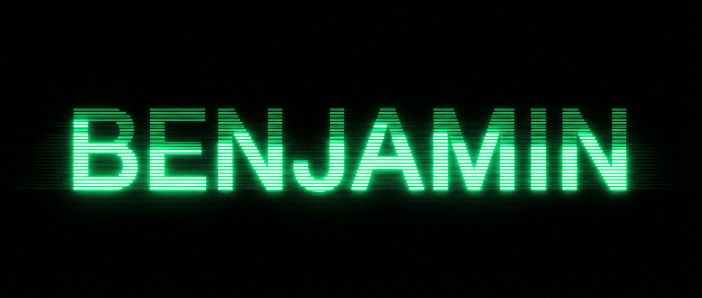

<p align="center">
  
</p>

<p align="center">
  <b>Discord voice bot that listens, transcribes, and responds when called by name.</b><br>
  Part of the <a href="../README.md">Pascribe</a> ecosystem.
</p>

<p align="center">
  
  
  
  
</p>

---

## Overview

Benjamin joins your Discord voice channel, captures per-user audio through Discord's DAVE E2EE encryption, and runs a triple wake word detection pipeline. Say "Benjamin" and he'll respond with a contextual AI reply within ~15 seconds.

### Wake Word Detection (Triple Pipeline)

| Layer | Engine | Latency | Cost | Catch Rate |
|-------|--------|---------|------|------------|
| 1. Local | Vosk STT (offline, CPU) | ~2s | Free | ~70% |
| 2. Streaming | AssemblyAI real-time | ~5s | $0.60/hr | ~50% |
| 3. Batch | AssemblyAI (30s interval) | ~30s | $0.21/hr | ~95% |

All three feed into a unified trigger system with **30-second global cooldown** — only one response per mention.

### Response Flow

```
🎤 "Hey Benjamin" detected
  → 🔔 Chime plays in VC (or 🔕 cooldown beep if blocked)
  → ⏳ Placeholder posted to #voice-reports
  → 🤖 Claude Opus generates contextual response
  → 💬 Response posted, placeholder auto-deletes
```

## Architecture

```
Discord Voice (DAVE E2EE)
    │
    ▼
┌──────────────────┐
│  UserAudioSink   │  Transport decrypt → DAVE decrypt → Opus decode
└──┬────┬────┬─────┘
   │    │    │
   ▼    ▼    ▼
 Vosk  Stream  VAD + Batch
(local) (AAI)  (AAI)
   │    │       │
   └──┬─┘       │
      ▼         ▼
  Trigger    Transcript
  System     Archive
      │
      ▼
  OpenClaw → Claude → Discord
```

## Features

| Feature | Description |
|---------|-------------|
| 🎙️ Per-user capture | Separate audio streams per speaker, VAD filtered |
| 🔐 DAVE E2EE | Full Discord voice encryption support (MLS protocol v1) |
| 🗣️ Wake word | "Benjamin" triggers AI response via triple detection |
| ⚡ Instant feedback | Audio chimes for trigger/cooldown, ⏳ placeholder in chat |
| 📝 Transcription | Dual pipeline — streaming (real-time) + batch (archive) |
| 🤖 AI responses | Claude Opus, context-aware, anti-repetition system |
| 📊 Daily reports | Auto-generated conversation summaries |
| 🔄 Self-improving | Nightly cron reviews response quality and tunes prompts |
| 🛡️ Privacy | Voice opt-out keywords, channel blacklisting |

## Setup

### Prerequisites

```bash
sudo apt install ffmpeg libopus0
```

### Install

```bash
cd bot
python3 -m venv venv
source venv/bin/activate
pip install -r requirements.txt
cp .env.example .env
```

### Configuration

```env
DISCORD_TOKEN=            # Discord bot token
ASSEMBLYAI_API_KEY=       # AssemblyAI API key ($50 free credits at signup!)
GUILD_ID=                 # Target Discord server ID
REPORT_CHANNEL_ID=        # Channel for voice trigger responses
OPENCLAW_GATEWAY_URL=     # OpenClaw gateway URL (for AI responses)
OPENCLAW_GATEWAY_TOKEN=   # OpenClaw auth token
OPENROUTER_API_KEY=       # Optional: free transcript analysis
```

> 💡 **AssemblyAI offers $50 free credits** on signup at [assemblyai.com](https://www.assemblyai.com) — enough for ~230 hours of batch transcription.

### Run

```bash
# Direct
python main.py

# Systemd service (recommended)
cp benjamin.service ~/.config/systemd/user/
systemctl --user enable --now benjamin
```

## Files

```
main.py                     Bot entrypoint, voice management, wake word routing
config.py                   Environment configuration
triggers.py                 Unified trigger system (cooldown, prompt, webhook)
wakeword.py                 Local Vosk wake word detector (offline, CPU-only)
analysis.py                 Transcript analysis via OpenRouter (optional)
self_improve.md             Self-improvement log (auto-updated nightly)
audio/
  capture.py                DAVE decrypt → Opus decode → PCM → VAD pipeline
  vad.py                    WebRTC VAD speech segmenter
  storage.py                WAV file storage + segment tracking
transcription/
  assemblyai.py             AssemblyAI batch API client
  pipeline.py               Per-segment transcription orchestration
  streaming.py              Per-user real-time streaming transcription
commands/
  slash.py                  /pascribe process & /pascribe status
assets/
  trigger_chime.wav         Ascending two-tone (trigger accepted)
  cooldown_chime.wav        Descending beep (cooldown active)
  banner.png                README banner
```

## Cost Estimate

| Component | Cost | Notes |
|-----------|------|-------|
| Vosk wake word | Free | Local CPU, ~67MB model |
| AssemblyAI batch | ~$0.21/hr | Per-segment transcription |
| AssemblyAI streaming | ~$0.60/hr | Per-user real-time (optional) |
| Claude response | ~$0.05/trigger | Via OpenClaw webhook |
| **Typical daily** | **$5–15** | Depends on VC activity |

## Technical Details

- **DAVE E2EE**: Protocol v1, `aead_xchacha20_poly1305_rtpsize` transport, MLS group key exchange via `davey` package
- **Audio**: 48kHz stereo PCM → mono downsample → 16kHz for Vosk/streaming
- **VAD**: WebRTC VAD aggressiveness=3 (high, filters mic noise)
- **Vosk model**: `vosk-model-small-en-us-0.15` (~67MB, English, offline)
- **Anti-repetition**: Past responses cached and injected into prompt
- **Self-improvement**: Nightly cron reviews responses, adjusts prompts, logs findings

---

<p align="center">
  <sub>Benjamin is part of <a href="../README.md">Pascribe</a> — audio transcription tools for desktop and Discord.</sub>
</p>
